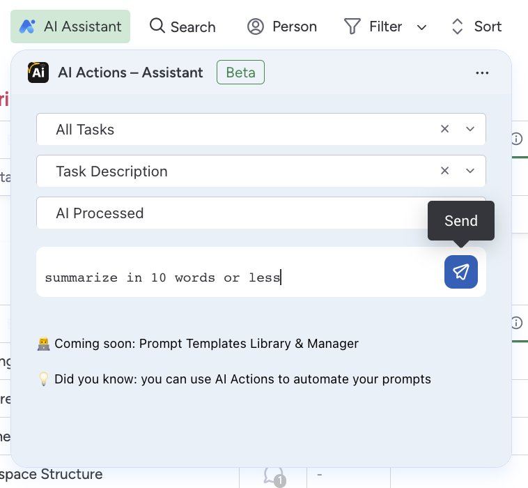
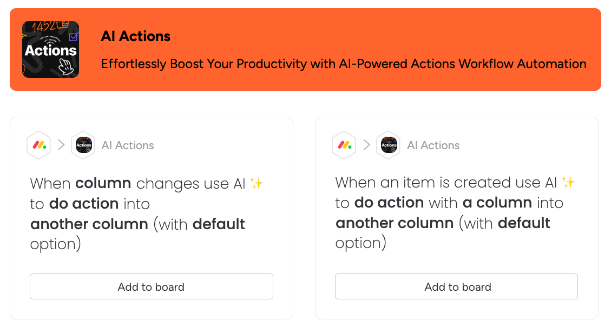

  

  <em>Take Your Work OS to the Next Level with AI-Powered Actions</em>

AI Actions – [monday.com](https://monday.com) [AI App Hackathon](https://lablab.ai/event/monday-ai-app-hackathon) participant, it allows you to leverage power of artificial intelligence
on monday.com platform using workflows and create productivity boosting
automation with zero learning curve.

## Solution
<h3 align="center">AI Actions – Assistant</h3>

  

Update board items in a batch, by selecting multiple columns and writing a prompt to leverage power of AI to improve productivity of you business.

<h3 align="center">AI Actions – Workflows</h3>

  

Automatic pipelines that makes your monday.com boards AI-powered, eliminating manual efforts to keep info up-to-date, use our digital buddy to improve your business processes and remove bottlenecks.

## Use Cases
- **Customer Support:** AI Actions can automatically categorize customer queries based on their content and urgency, forward them to the right department, and draft initial responses.
- **Project Management:** AI Actions can automatically generate sub-tasks from project descriptions, notify relevant team members, and summarize progress reports.
- **Sales and Marketing:** AI Actions can summarize market research, auto-generate social media posts, or evaluate and sort leads based on the contents of emails or messages.
- **Content Creators and Bloggers:** AI Actions can auto-generate content briefs, summarize long-form content, extract keywords for SEO, and automate the publication process.
- **HR and Recruitment:** AI Actions can analyze job applications, shortlist candidates based on certain criteria, and auto-generate interview invitations or rejection letters.

## Roadmap
- Introduce prompt templates library & manager
- Generate images using AI Assistant and Workflows
- Generate sub-items using AI Assistant and Workflows
- Changes preview for AI Assistant
- Work with multiple columns and conditions

## Acknowledgements
- [mondaycom/welcome-apps | quickstart-integrations](https://github.com/mondaycom/welcome-apps/tree/master/apps/quickstart-integrations) by Dor Shaked
- [yuhgto/monday-ai-prompt-template](https://github.com/yuhgto/monday-ai-prompt-template) by yuhgto Dipro Bhowmik and ShayElkana
