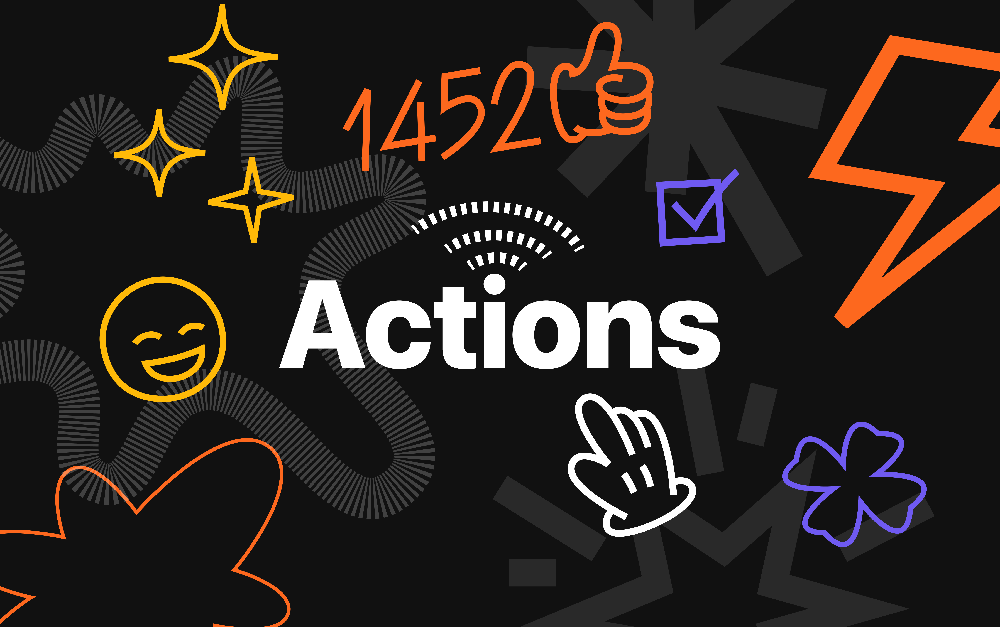

  

  <em>Take Your Work OS to the Next Level with AI-Powered Actions</em>

AI Actions – [monday.com](https://monday.com) [AI App Hackathon](https://lablab.ai/event/monday-ai-app-hackathon) participant, it allows you to leverage power of artifical intelligence
on monday.com platform using workflows and create productivity boosting
automation with zero learning curve.

## Showcase
TBD

## How to Install
TBD

## Acknowledgements
- https://github.com/mondaycom/welcome-apps/tree/master/apps/quickstart-integrations Dor Shaked
- https://github.com/yuhgto/monday-ai-prompt-template yuhgto Dipro Bhowmik, ShayElkana
